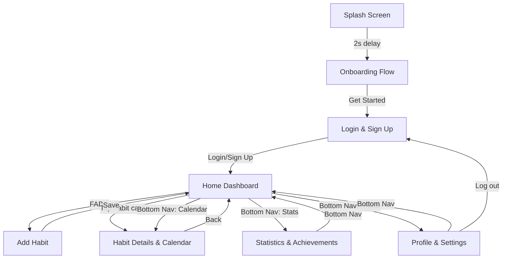

# HabitFlow Premium Tracker — Flutter Implementation

Convert all 9 Google Stitch screens from "HabitFlow Premium Tracker" into a working Flutter mobile app with full navigation.

## Screens Identified (from Stitch)

| # | Screen | Key Elements |
|---|--------|-------------|
| 1 | **Splash Screen** | Gradient background (indigo→purple), floating glass orbs, HabitFlow logo with `all_inclusive` icon, "Luminous Routine" subtitle, pulsing loading dots |
| 2 | **Onboarding Flow** | 3-slide carousel (Track/Consistency/Achievements), AI-generated illustrations, glass cards, progress dots, Skip/Next/Get Started buttons |
| 3 | **Login & Sign Up** | Toggle between Login/Sign Up views, glassmorphic card, email/password inputs with icons, Google/Apple social login, gradient CTA buttons |
| 4 | **Home Dashboard** | Greeting, circular progress ring (75% daily goal), streak/completed stats, habit cards (Drink Water, Read, Workout) with checkboxes, FAB (+), bottom nav bar |
| 5 | **Add Habit** | Form with habit name input, category chips (Health/Fitness/Mind/Learning/Career), color picker circles, frequency segmented control (Daily/Weekly/Custom), reminder time picker, "Save Habit" gradient button |
| 6 | **Habit Details & Calendar** | Progress ring (75%), streak stats (12 day, 45 total, 21 longest), weekly line chart, monthly calendar heatmap, motivational quote |
| 7 | **Statistics & Achievements** | Analytics header, weekly bar chart (82%), donut chart (Focus Areas), streak/best habit mini cards, trophies grid (unlocked/locked with progress bars) |
| 8 | **Profile & Settings** | Profile card (avatar, name, level badge, bio), stats bento grid, settings groups (Preferences/Notifications/Data) with toggles, log out button |
| 9 | **Notifications, Empty & Success** | Tabbed view: Alerts (notification items with toggles), Empty state (illustration + "Start Tracking" CTA), Success state (animated ring, confetti, "Momentum Built!") |

## Design System (from Stitch)

- **Font**: Inter (all weights 400-700)
- **Primary**: `#4648D4` (Indigo) / Container: `#6063EE`
- **Secondary**: `#6B38D4` (Purple) / Container: `#8455EF`
- **Tertiary**: `#006577` (Teal) / Fixed-Dim: `#4CD7F6` (Cyan)
- **Surface**: `#F7F9FB` / On-Surface: `#191C1E`
- **Style**: Glassmorphism — frosted glass cards (`white/25%`, `blur(20px)`), gradient backgrounds, luminous shadows
- **Spacing**: 8pt grid, 20px container padding, 48px touch targets
- **Border Radius**: Cards `24px`, buttons `full/pill`, chips `12px`

## Proposed Architecture

```
d:\mobile_app\
├── lib/
│   ├── main.dart                    # App entry, routes, theme
│   ├── theme/
│   │   └── app_theme.dart           # Complete design system (colors, typography, glass styles)
│   ├── widgets/
│   │   ├── glass_card.dart          # Reusable glassmorphic container
│   │   ├── bottom_nav_bar.dart      # Shared bottom navigation
│   │   ├── progress_ring.dart       # SVG-like circular progress
│   │   ├── habit_card.dart          # Habit list item with checkbox
│   │   └── gradient_button.dart     # Primary → Secondary gradient button
│   ├── screens/
│   │   ├── splash_screen.dart       # Screen 1
│   │   ├── onboarding_screen.dart   # Screen 2
│   │   ├── login_screen.dart        # Screen 3
│   │   ├── home_screen.dart         # Screen 4
│   │   ├── add_habit_screen.dart    # Screen 5
│   │   ├── habit_detail_screen.dart # Screen 6
│   │   ├── statistics_screen.dart   # Screen 7
│   │   ├── profile_screen.dart      # Screen 8
│   │   └── notifications_screen.dart # Screen 9
│   └── models/
│       └── habit.dart               # Habit data model
├── pubspec.yaml
└── assets/                          # Onboarding illustrations (network URLs)
```

## Navigation Flow



## Key Implementation Details

### Glassmorphism in Flutter
- Use `ClipRRect` + `BackdropFilter` with `ImageFilter.blur(sigmaX: 20, sigmaY: 20)`
- Container with `color: Colors.white.withValues(alpha: 0.25)` and `Border.all(color: Colors.white.withValues(alpha: 0.4))`
- Wrap in `DecoratedBox` with luminous box shadows using primary color at 5% opacity

### Bottom Navigation
- Custom `BottomNavigationBar` with 4 tabs: Home, Calendar, Stats, Profile
- Frosted glass background matching Stitch design
- Active tab uses filled icon + primary color

### Animations
- Splash: Floating glass orbs (using `AnimationController`), pulsing loading dots
- Onboarding: `PageView` with smooth transitions, animated progress dots
- Home: Progress ring with animated stroke dash
- Success: Filling circular progress, confetti particles

### Dependencies
- `google_fonts` — for Inter font
- `fl_chart` — for bar/line charts in Statistics & Habit Details
- No other external deps needed (all glassmorphism done with built-in `BackdropFilter`)

## Verification Plan

### Automated Tests
- `flutter analyze` — ensure no lint errors
- `flutter build apk --debug` — verify build succeeds

### Manual Verification
- `flutter run` on connected device/emulator
- Navigate through all 9 screens
- Verify glassmorphism rendering, color matching, typography, spacing
- Test bottom navigation transitions

> [!IMPORTANT]
> This is a large implementation (~2500+ lines of Dart code across 15+ files). I'll create the Flutter project, implement all screens matching the Stitch designs pixel-for-pixel, wire up navigation, and run it locally.
